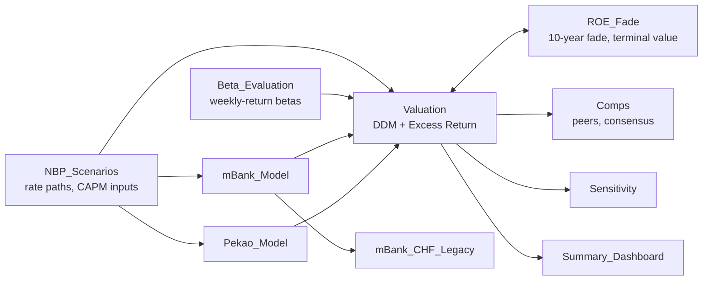

# How Interest Rates Move the Polish Banking Sector
 
> A comparative equity valuation of mBank and Bank Pekao under three NBP reference-rate scenarios, how central-bank rate moves flow through to bank value, and what today's share prices already assume.
 
**Author:** Szymon Rosiński  
**Status:** Completed September 2026 (valuation date: 31 July 2026)  
**Data:** IFRS financial statements of mBank and Bank Pekao (FY2021–FY2025, H1 2026), NBP Macroeconomic Survey (June 2026), weekly quotes from Stooq.pl  
**Access to: [Scope of Work](Docs/Scope_of_Work_Banking_Sector_FINAL.docx), [Investor Memo (Polish)](Docs/Investor_Memo_PL_FINAL.docx), [Valuation Model](Docs/DDM_Model_ENG_FINAL.xlsx)**
 
---
 
## Table of Contents
 
1. [Background and Overview](#1-background-and-overview)
2. [Data Structure Overview](#2-data-structure-overview)
3. [Executive Summary](#3-executive-summary)
4. [Insights Deep Dive](#4-insights-deep-dive)
5. [Recommendations](#5-recommendations)
---
 
## 1. Background and Overview
 
Polish bank earnings move with the central bank. As the average NBP reference rate climbed from 0.34% in 2021 to 6.45% in 2023, mBank's net interest margin almost doubled, from 2.1% to 3.9% of assets. With the NBP now easing (3.75% at the valuation date), investors need to know how much of today's bank valuations depends on the rate path.
 
This project values the equity of **mBank** and **Bank Pekao** under three reference-rate paths (Hike, Base and Cut) taken from the NBP's own Macroeconomic Survey, and turns the result into a policy-style brief for investors focused on the Polish banking sector.
 
**Why these two banks.** A single bank naturally does not represent the sector. mBank and Pekao sit at opposite ends of the Polish banking spectrum. They differ primarily in how heavily legacy CHF mortgages weigh on their balance sheets and in the scale of their operations, while sharing exposure to the same rate cycle. mBank is emerging from a long CHF-litigation overhang (legal-risk costs fell from a PLN 4.9 bn peak in 2023 to PLN 2.0 bn in 2025). Pekao, on the other hand, carries one of the smallest CHF portfolios in the market. Comparing the two separates sector-wide rate sensitivity from bank-specific risk.
 
The project addresses four questions:
 
1. **What are the two banks worth?**: fair value under each rate path, and how uncertain it is
2. **How does the NBP rate reach bank value?**: the margin, discount and terminal channels
3. **What does today's share price assume?**: the conditions under which the market is right
4. **What does it mean for investors?**: sector-wide comparison, analyst consensus and a recommendation
> **Out of scope:** an overall analysis of the Polish banking sector, the correlation between political decisions and those made by the NBP, and how the findings affect regular consumers.
 
### Deliverables & Timeline
 
| Milestone | Description |
| --- | --- |
| Scope and data collection | Scope refined; IFRS reports, share-price data and macroeconomic context gathered for both banks; Excel sheets prepared for clean documentation |
| Data cleaning and processing | Five years of historical financials spread in Excel and reconciled to the audited statements; inconsistencies and unexpected trends flagged |
| Valuation | DDM and Excess Return valuations for all three NBP scenarios, double-checked and compared with listed peers and analyst consensus |
| Visualisation and delivery | Investor memo built on the findings and packaged in a ready-to-ship format |
 
### Limitations
 
- **Terminal value dominates.** Even after the ROE fade, 74.8% of mBank's and 70.8% of Pekao's fair value comes from the terminal value.
- **The 75% dividend cap.** 75% is the top of both banks' declared ranges (30–75% in mBank's 2026–2030 strategy, 50–75% in Pekao's dividend policy) and the maximum KNF allowed for payouts from 2025 profit. Paradoxically, a lower payout raises value through higher retention. However, for values below 61.6% (mBank) or 63.9% (Pekao), long-run growth would exceed nominal GDP, which makes the assumption unreasonable.
- **H2 2026 not yet reported.** FY2026 combines reported H1 2026 results with an H2 estimate that differs between scenarios only through the rate path. Other factors such as fees, operating costs and provisions are kept constant.
- **Peer figures are a ranking tool.** CHF/FX legal-cost definitions differ across banks, and P/B divides a mid-2026 price by end-2025 book value.
- **Consensus dates differ.** mBank's consensus (11.02.2026) predates the H1 2026 results; Pekao's (21.08.2026) follows them.
- **Outside the model:** the term structure of assets and liabilities, legal risk beyond the CHF portfolio, regulatory changes, strategy-execution risk and shareholder structure (mainly relevant for mBank).
---
 
## 2. Data Structure Overview
 
| Property | Value |
| --- | --- |
| Banks | mBank and Bank Pekao, plus four WIG-Banki peers in the comparison set |
| Financial statements | IFRS consolidated statements FY2021–FY2025 and H1 2026 interim reports |
| Rate scenarios | NBP Macroeconomic Survey, June 2026 round (No. 2/2026, 21 forecasters) |
| Market data | Weekly closes for mBank, Pekao, WIG20, WIG, WIG-Banki and WIG20TR (Jan 2024 – Jul 2026) |
| Cost-of-equity inputs | Damodaran country-risk data (April 2026) |
| Valuation date | 31 July 2026 — closing prices PLN 1,351.50 (mBank) and PLN 245.50 (Pekao) |
| Horizon | Five-year forecast (2026–2030), a 10-year ROE fade, then a Gordon terminal value |
| Units | PLN thousands for financials, PLN per share for valuations |
 
### Workbook Structure
Key financial data and calculations are aggregated in the Excel workbook: the NBP scenario paths, the mBank and Pekao financial spreads, the DDM model and the ROE fade. As stated above, financial figures are in PLN thousands and valuations in PLN per share. The diagram below shows a simplified flow of data through the workbook.
 

 
| Tab | Contents |
| --- | --- |
| `README` | Result, scope, method, reading guide, built-in checks and key assumptions |
| `NBP_Scenarios` | Market anchors, the three reference-rate paths for 2026–2030 and the cost-of-equity building blocks |
| `mBank_Model` | FY2021–FY2025 historicals, FY2026 bridge from H1 2026, five-year forecast in three scenarios, NIM-beta and cost-of-risk blocks |
| `Pekao_Model` | Same structure, row for row |
| `mBank_CHF_Legacy` | CHF-mortgage wind-down data and the basis for peer normalisation |
| `Beta_Evaluation` | Weekly-return regressions against four benchmarks (WIG20, WIG, WIG-Banki, WIG20TR) |
| `Valuation` | DDM and Excess Return for both banks in three scenarios, cost of equity by scenario, terminal-state checks |
| `ROE_Fade` | 10-year fade ladders, fade-parameter sensitivity, terminal ROE × cost-of-equity grid, payout stress test |
| `Comps` | Six-bank P/B vs ROE (reported, CHF-normalised and with fade) and the analyst-consensus comparison |
| `Sensitivity` | Cost-of-equity grid scaled by the beta standard error, WIG benchmark variant, ±10% tests of operating assumptions |
| `Summary_Dashboard` | Headline comparison pulled live from the other tabs |
 
### Methodology
 
- **Why DDM and Excess Return, not DCF.** An unlevered DCF cannot be built for a bank. Deposits and loans are considered the operating business, not financing. Naturally then, debt cannot be separated out as in an industrial company. Banks are valued through the dividends shareholders actually receive (DDM) or through returns above the cost of equity on book value (Excess Return).
- **Forecast.** FY2026 is half fact: the P&L is the one reported in H1 2026. Only H2 differs between scenarios through the margin channel. 2027–2030 follow an explicit set of assumptions (asset CAGR, NIM beta, strategic cost of risk and the dividend payout path).
- **Cost of equity (CAPM), set per scenario.** Risk-free rate of 4.40% (10-year yield of 5.30% minus a 0.90% default spread), moved with each rate path at a 0.70 pass-through; equity risk premium of 6.01%; beta vs WIG20 of 1.30 (mBank) and 1.47 (Pekao) from 104 weekly observations.
- **Terminal value.** ROE fades linearly over ten years to the cost of equity + 3 pp, with the Gordon growth formula applied at the end.
- **A consistency check, not a second opinion.** Excess Return reproduces the DDM to the grosz. Under clean-surplus accounting the two are algebraically the same model, so the match confirms the forecast's accounting consistency rather than validating the value independently.
### Tech Stack
 
| Stage | Tools |
| --- | --- |
| Data collection | Bank investor-relations reports (IFRS annual and interim), **NBP** survey data, **Damodaran** datasets, **Stooq.pl** quotes |
| Modelling | **Microsoft Excel**: three-scenario forecast, DDM, Excess Return, peer comps, sensitivity grids |
| Statistics | Excel regression functions (`SLOPE`, `STEYX`, `RSQ`, `TINV`) for market and NIM betas, standard errors and confidence intervals |
| Presentation | Investor memo (policy-style brief, in Polish) |
| Workflow assist | AI-assisted model review and consistency checks |
 
### Sources
 
- Consolidated financial statements of mBank Group and Bank Pekao Group, 2021–2025, and H1 2026 interim reports
- [NBP Macroeconomic Survey, June 2026 round (No. 2/2026)](https://nbp.pl/polityka-pieniezna/ankieta-makroekonomiczna/) — 21 forecasters, surveyed 3–17 June 2026
- [Damodaran — country risk data, April 2026](https://pages.stern.nyu.edu/~adamodar/)
- [mBank Group Strategy 2026–2030](https://www.mbank.pl/pdf/relacje-inwestorskie/introduction-to-mbank-pol.pdf), [Bank Pekao dividend policy](https://www.pekao.com.pl/relacje-inwestorskie/akcje/dywidenda.html), [KNF position on dividend policy in 2026](https://www.knf.gov.pl/knf/pl/komponenty/img/Stanowisko_KNF_ws_polityki_dywidendowej_w_2026_roku_96591.pdf)
- Analyst consensus from the investor-relations pages of both banks; weekly share and index quotes from Stooq.pl
- Shareholder and merger context: [Retail Banker International](https://www.retailbankerinternational.com/news/unicredit-commerzbank-takeover/), [Commerzbank](https://www.commerzbank.de/group/newsroom/press-releases/result-tender-offer-unicredit.html), Rzeczpospolita ([1](https://www.rp.pl/banki/art44792691-unicredit-coraz-blizej-przejecia-wlasciciela-mbanku-ma-juz-niemal-polowe-akcji), [2](https://www.rp.pl/banki/art44843831-jak-unicredit-podbija-europejski-rynek), [3](https://www.rp.pl/banki/art43537281-pzu-i-bank-pekao-daja-sobie-wiecej-czasu-na-prace-nad-ewentualna-fuzja))
---
 
## 3. Executive Summary
 
- **Both banks trade well above fair value.** The Base-scenario DDM puts mBank at PLN 872.03 against a PLN 1,351.50 share price (−35.5%) and Pekao at PLN 198.99 against PLN 245.50 (−18.9%). The downside holds in all three NBP scenarios and across the full 95% confidence interval of the beta estimate.
- **The market is pricing durable profitability, not rates or risk.** Today's prices are fair only if mBank earns an ROE of about 23.6% and Pekao about 20.8% in perpetuity: above mBank's own forecast peak of 20.5% and, for mBank, implying faster-than-GDP growth forever.
- **Rates move value but do not close the gap.** The margin channel outweighs the discount channel. The 93 bp spread between the Cut and Hike paths is worth 10.0% of mBank's value and 6.3% of Pekao's, yet even the Hike path leaves mBank 32.2% below its price.
- **The relative call.** Pekao is 16.5 pp less overvalued than mBank and stays the cheaper of the two in every rate scenario and every ROE-fade variant tested.
- **The model and the analysts agree on earnings.** Pekao's 2026 profit forecast is within 0.5% of consensus while its fair value is 23.5% below the consensus target, showing that the disagreement sits entirely in the terminal value.
- **Recommendation: prefer Pekao over mBank.** Buy or Hold Pekao; Hold or Sell mBank, watching its dividend restart and the close-out of its CHF book as the catalysts.
---
 
## 4. Insights Deep Dive
 
### 4.1 The uncertainty of fair value
 
The valuation discounts five years of forecast dividends plus a terminal value, at a CAPM cost of equity set separately for each rate path.
 
| | mBank | Pekao |
| --- | --- | --- |
| Reference price (31.07.2026) | PLN 1,351.50 | PLN 245.50 |
| **Fair value, Base scenario** | **PLN 872.03** | **PLN 198.99** |
| **Deviation from price** | **−35.5%** | **−18.9%** |
| Hike / Cut scenarios | −32.2% / −38.6% | −16.3% / −21.4% |
| 95% confidence interval (beta error) | −28.1% to −41.7% | −13.1% to −24.1% |
| Without ROE fade | −15.6% | −10.3% |
| Terminal value share of fair value | 74.8% | 70.8% |
 
**Beta error does not rescue the price.** Market beta is an estimate based on 104 weekly returns against the WIG20 and has its own standard error. Carrying its 95% interval through CAPM and the valuation still leaves mBank between −28.1% and −41.7%. For fair value to equal the price, mBank's beta would have to be 0.50, which is statistically very unlikely.
 
**The profitability fade is the real source of uncertainty.** The model fades ROE linearly over ten years to 3 pp above the cost of equity before the Gordon formula applies. Moving that one parameter across its range shifts mBank's upside from −44.0% (zero economic profit in steady state) to −15.6% (no fade: today's profitability forever). By contrast, flexing each operating assumption of the five-year forecast (asset growth, cost of risk, cost growth, NIM beta) by ±10% moves mBank's value within a range of 4.9% at most, and all four together weigh less than the single terminal assumption. The NIM beta, which took up the most diagnostic work, turns out to be the least important of the four (0.87% of mBank's value).
 
**The relative conclusion is stronger than the absolute one.** The fade moves both banks in the same direction. At every terminal-profitability level tested, Pekao stays less overvalued than mBank (by 5.3 pp with no fade, up to 17.4 pp with a fade target of cost of equity + 5 pp). Changing how the fade is anchored narrows the lead to about 6 pp at most. The ranking flips only when no fade coincides with a beta at the bottom of its confidence interval.
 
### 4.2 How the NBP rate reaches bank value
 
The reference rate enters the valuation through three channels:
 
1. **Margin channel (positive):** a regression over 21 quarters puts the sensitivity of the net interest margin to the reference rate at 0.328 for mBank and 0.298 for Pekao (R² ≈ 0.91). Because H1 2026 is already reported, the scenarios start diverging from H2 2026.
2. **Discount channel (negative):** higher rates lift bond yields as well as the risk-free rate and the cost of equity. The model passes 0.70 of a change in the short rate through to the 10-year yield.
3. **Terminal channel (close to zero):** steady-state ROE is anchored 3 pp above the cost of equity, so higher rates lift terminal ROE and the discount rate together.
| NBP path (2026–2030 average) | Cut 3.07% | Base 3.53% | Hike 4.00% |
| --- | --- | --- | --- |
| mBank cost of equity | 11.76% | 12.09% | 12.42% |
| mBank terminal ROE | 14.76% | 15.09% | 15.42% |
| mBank 2026 net profit | PLN 4,148 mn | PLN 4,232 mn | PLN 4,330 mn |
| mBank fair value | PLN 829.53 | PLN 872.03 | PLN 916.89 |
| Pekao fair value | PLN 192.89 | PLN 198.99 | PLN 205.49 |
 
**Net effect: the margin channel wins.** The 93 bp difference in the average NBP rate over five years is worth 10.0% of mBank's value and 6.3% of Pekao's, so Monetary Policy Council (RPP) decisions have a decisive impact on banks. They do not, however, explain the gap between the model and the market.
 
The paths come from the NBP Macroeconomic Survey (June 2026): Base is the central forecast, while Hike and Cut are the upper and lower bounds of the survey's 50% probability interval. The scenarios therefore mark the edges of the forecasters' own typical range.
 
### 4.3 Read-across to the Polish banking sector
 
Ranking six listed banks by their premium to a justified P/B gives two different answers, depending on whether the legal-risk costs of FX mortgages are normalised:
 
| Bank | Premium on reported ROE | Premium after CHF normalisation | Normalised, with 10-year ROE fade |
| --- | --- | --- | --- |
| Bank Millennium | +135.1% | −16.5% | +39.4% |
| mBank | +91.3% | +17.1% | +69.3% |
| PKO BP | +34.1% | −3.8% | +39.1% |
| Erste Bank Polska | +25.4% | +0.4% | +33.1% |
| ING Bank Śląski | +17.6% | +16.3% | +63.8% |
| Bank Pekao | −0.8% | −9.4% | +17.1% |
 
Normalisation visibly reorders the sector: Bank Millennium goes from the most expensive bank on reported ROE (+135.1%) to the cheapest once CHF costs are stripped out (−16.5%). On the normalised basis mBank is the most expensive (+17.1%), with Pekao near the cheap end (−9.4%).
 
The last column applies the DDM's fade assumption to all six banks: normalised ROE fades linearly over ten years to the cost of equity + 3 pp at a 75% payout, using a sector-wide cost of equity and growth rate. The first two columns rank the banks, the last one shows the level. On that basis no bank in the sector looks cheap (mBank remains the most expensive one (+69.3%) and Pekao becomes the cheapest (+17.1%)).
 
**Rate sensitivity differs between banks** (10.0% vs 6.3% of value across the survey range). Therefore, a view on rates should drive stock selection within the sector, not only the size of the sector allocation.
 
**Dividend capacity is a regulatory variable.** Most of both valuations sits in the terminal value (74.8% and 70.8%), which depends above all on the payout ratio reaching 75% in 2030. Whether such payouts happen is decided mainly by the supervisor's dividend-policy criteria rather than by bank results, making it the main source of risk shared by the whole sector.
 
### 4.4 What today's share price assumes
 
| Channel through which the market could be right | mBank | Pekao | Realistic? |
| --- | --- | --- | --- |
| Lower risk: implied beta | 0.50 vs 1.30 | 1.02 vs 1.47 | No: 7.0 and 5.7 standard deviations below the estimate |
| Lower cost of equity | 7.26% vs 12.09% | 10.36% vs 13.07% | No: below the cost of equity of far lower-risk companies |
| Higher NBP rates | Gap stays open (Hike: −32.2%) | Gap stays open (Hike: −16.3%) | No: even the survey's upper bound is not enough |
| More durable profitability: terminal ROE | 23.62% vs 15.09% | 20.77% vs 16.07% | Yes: can close the gap |
| Implied long-run growth | 5.90% | 5.19% | For mBank, above nominal GDP growth (5.80%) |
 
- **The gap is not about rates.** Even the upper bound of the survey's 50% interval leaves mBank 32.2% below its share price.
- **The gap is not about risk.** Justifying today's price through the cost of equity alone would need a beta of 0.50 for mBank.
- **The gap is mostly about how long profitability lasts.** For today's price to be fair, mBank must hold a 23.62% ROE forever, above the model's own peak forecast of 20.47%. At a 75% payout that implies 5.90% annual growth in perpetuity, faster than nominal GDP (5.80%). For Pekao the requirement is more realistic but still demanding (20.77% ROE, 5.19% growth).
### 4.5 Cross-check against analyst consensus
 
To test the model against an external benchmark, the results were compared with the analyst consensus published by the banks themselves.
 
| | mBank | Bank Pekao |
| --- | --- | --- |
| Consensus target price | PLN 985.30 | PLN 260.04 |
| Institutions / date | 8 / 11.02.2026 | 16 / 21.08.2026 |
| Recommendation split | Not published | 8 buy / 8 hold / 0 sell |
| Consensus vs share price | −27.1% | +5.9% |
| Model fair value | PLN 872.03 | PLN 198.99 |
| Model vs consensus target | −11.5% | −23.5% |
| 2026 net profit: consensus → model | PLN 3,846 → 4,232 mn (+10.0%) | PLN 5,761 → 5,792 mn (+0.5%) |
 
**mBank's fair value remains within the analysts' target-price range** (PLN 841.30–1,224.00), even if towards the lower end. The February 2026 average target itself sat 27% below the July share price.
 
**Agreement on earnings, disagreement on value.** For Pekao, where both consensus figures post-date the H1 2026 results, the 2026 profit forecasts differ by just 0.5% while the valuations differ by 23.5%. The key difference of opinion lies in the terminal block rather than the five-year forecast. mBank's 10% profit gap is a difference in information rather than a forecasting dispute: its consensus predates the H1 2026 results that anchor the model's 2026.
 
---
 
## 5. Recommendations
 
1. **Prefer Bank Pekao over mBank (Buy or Hold Pekao).** Pekao is the cheaper of the two in every rate scenario and in every cost-of-equity, beta and fade variant analysed. The ranking reverses only in the one combination where both share prices look justified. It is also the more resilient holding, with a steadier dividend policy and less exposure to CHF-portfolio risk.
2. **Hold or Sell mBank.** Heavy dependence on external shareholders, a history of high CHF-loan costs and a dividend that is only now being restored make mBank the weaker investment prospect. Selling also gives up the dividends mBank is set to pay over the next five years, an inherent cost of this choice.
3. **Let the rate view drive stock selection, not only sector exposure.** mBank's value is more rate-sensitive than Pekao's (10.0% vs 6.3% across the survey range).
4. **Catalysts that will confirm or refute the thesis.**
   - **Decisions on mBank's dividend capacity:** Most of mBank's value rests on its dividend restart reaching a 75% payout. That decision should come by the end of the 2027 dividend season at the latest.
   - **mBank's first payout from 2026 profit, due in 2027:** The first test of the planned 30% → 75% payout ramp over 2027–2030.
   - **Close-out of mBank's CHF portfolio (end 2026 / early 2027):** Removing these costs should lift ROE and narrow the gap between mBank's price and its modelled fair value.
   The forecasts would miss if mBank were to depart from its declared dividend policy, were to fail to fully close out the CHF portfolio, or were to pay an inadequate dividend for 2026.
5. **Monitor the overarching risks.**
   - **A slower fade, or none at all.** Single percentage points have a big impact on the valuation. With a fade target of cost of equity + 5 pp, mBank's downside shrinks to −28.9%, and to −15.6% with no fade.
   - **How the fade is anchored.** An alternative anchoring cuts Pekao's lead over mBank from 16.5 pp to about 6 pp.
   - **Shareholder events.** UniCredit holds 49.65% of the votes at the general meeting of Commerzbank, mBank's main shareholder; crossing 50% would trigger a mandatory tender offer, with an indirect but significant effect on mBank's valuation. For Pekao, the deadline for a merger with PZU has moved to 31.12.2027, provided the enabling legislation passes by the end of 2026.
 
